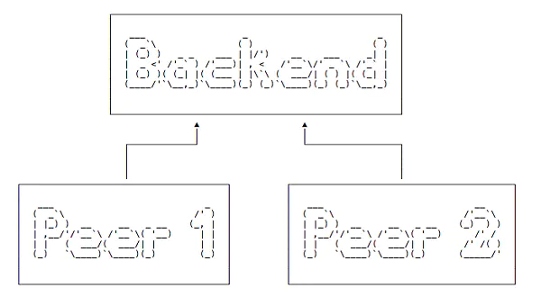
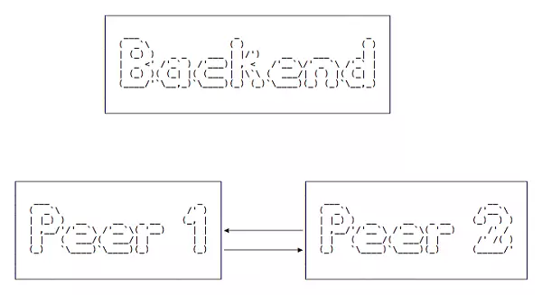
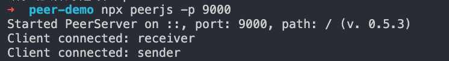

## webrtc-demo

- [demo1](./demo1/index.html): 调用本地摄像头和音频
- [demo2](./demo2/index.html): 创建本地点对点通信，即 A 获取音频，B 呼叫 A， B 获得 A 的音频并播放
- [demo3](./demo3/index.html): 使用 `RTCDataChannel` 通信，发送文本信息
- [demo4](./demo4): 通过网络传输 实现点对点服务 注意 `navigator.getUserMedia`只有在 `localhost` 或者 `https` 等安全环境下才可以用
- [demo5](./demo5): 使用 [peerjs](https://github.com/peers/peerjs) 实现直接点对点通信
- [demo5](./demo6): 使用 [peerjs](https://github.com/peers/peerjs) 实现直接点对点视频通信

## 参考链接

- [阮一峰 WebRTC](http://www.w3cbus.com/htmlapi/webrtc.html)

# demo5

## 开始

首先我们需要创建后端。尽管我们会实现直接点对点通信，起初的握手和合作需要中心服务器。



一旦握手完成，点点之间会直接交流，而不再需要依靠后端。



`PeerJS` 为我们提供了这样一个服务器，安装过程很简单，容易运行。

## 步骤

1. 安装 `peerjs`, 并启动

```bash
npm init -y
npm i peer --registry=https://registry.npm.taobao.org

# 启动命令
npx peerjs -p 9000

# 你也可以添加在 package.json 的启动脚本中
```

2. 创建 `peer1.html` `peer2.html`

> `peer1`: 接收端，连接 PeerJS 服务器，等待接收信息。第一个参数 `new Peer()`为我们的端点名称，我们叫做 `receiver`，使得表意更清晰。

初始化 `Peer` 对象。当另一个端点连接我们的时候，`Connection` 事件被调用。当接收到一些信息之后，`data` 事件被调用

```html
<script src="https://cdnjs.cloudflare.com/ajax/libs/peerjs/0.3.16/peer.min.js"></script>
<script>
  const peer = new Peer('receiver', {
    host: 'localhost',
    port: 9000,
    path: '/',
  });
  peer.on('connection', conn => {
    conn.on('data', data => {
      console.log(data);
    });
  });
</script>
```

> `peer2`: `sender`，因为它会连接并发送信息到接收端。

初始化 `Peer` 对象，接着请求端点连接 `receiver` 端，接收端我们之前已经创建好。一旦连接建立，`open` 事件启动，接着调用 `send()`方法来向接收端发送信息：

```html
<script src="https://cdnjs.cloudflare.com/ajax/libs/peerjs/0.3.16/peer.min.js"></script>
<script>
  const peer = new Peer('sender', {
    host: 'localhost',
    port: 9000,
    path: '/',
  });
  const conn = peer.connect('receiver');
  conn.on('open', () => {
    conn.send('hi!');
  });
</script>
```

分别打开 `peer1.html` `peer2.html`, 查看 `peer1.html` 控制台可以看到 `hi!`

附：后端控制台


